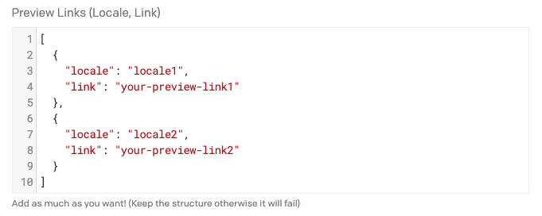
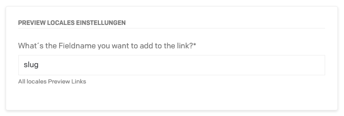

# Preview Links DatoCMS plugin

With this Plugin you can preview all your locales with different Preview Links. For example you can use Gatsby Cloud!

## Screenshots



You have to add the Links with them locales in this format in Plugin Settings.



In Field Settings you can enter the API Key of the Field you want to get the value from to put it behind your preview link.

## NPM Package

Install the Plugin:

```
npm i datocms-plugin-preview-locales
```

Install all the project dependencies with:

```
yarn install
```

Add this plugin in development mode to one of your DatoCMS project with:

```
yarn addToProject
```

Start the local development server with:

```
yarn start
```

The plugin will be served from [http://localhost:5000/](http://localhost:5000/). Insert this URL as the plugin [Entry point URL](https://www.datocms.com/docs/plugins/creating-a-new-plugin/).

## Donate

I know that much of us have wished us this function, so if you´re happy with it, you can donate me via Paypal! Thank you!

## License
This package is available under `MIT` License.